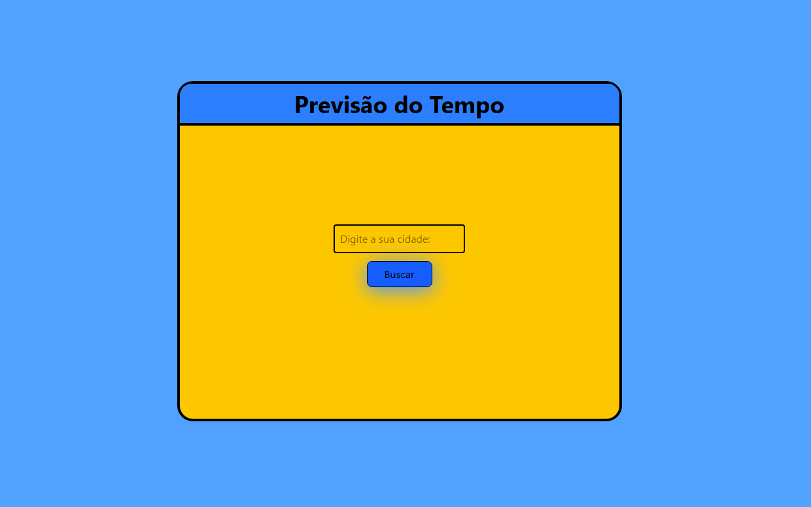
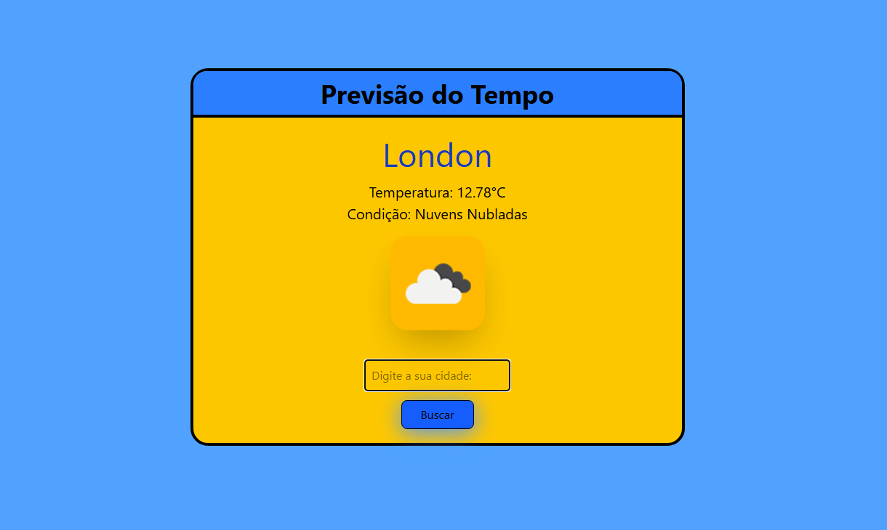

# 🌤️ React Weather App

Aplicação simples em React que permite ao usuário buscar o clima atual de uma cidade, utilizando a API do OpenWeatherMap.

[🔗 Acesse o site ](https://leen-lm.github.io/react-weather-app)

## 🚀 Funcionalidades

- Buscar cidade e exibir temperatura
- Tradução automática da condição climática (EN → PT)
- Interface responsiva com Tailwind CSS
- Dados consumidos da API do OpenWeatherMap

## 🧪 Tecnologias usadas

- React
- Tailwind CSS
- OpenWeatherMap API
- Vite

## 📸 Screenshots




## 📦 Como rodar localmente

```bash
git clone https://github.com/Leen-lm/react-weather-app
cd react-weather-app
npm install
npm run dev